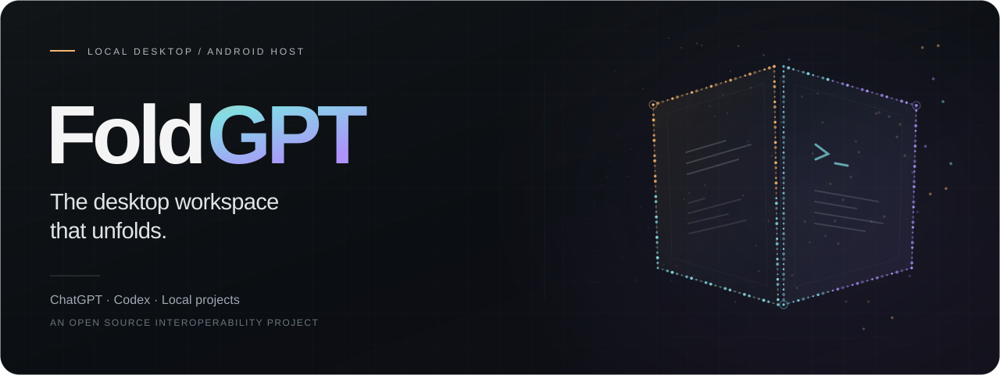
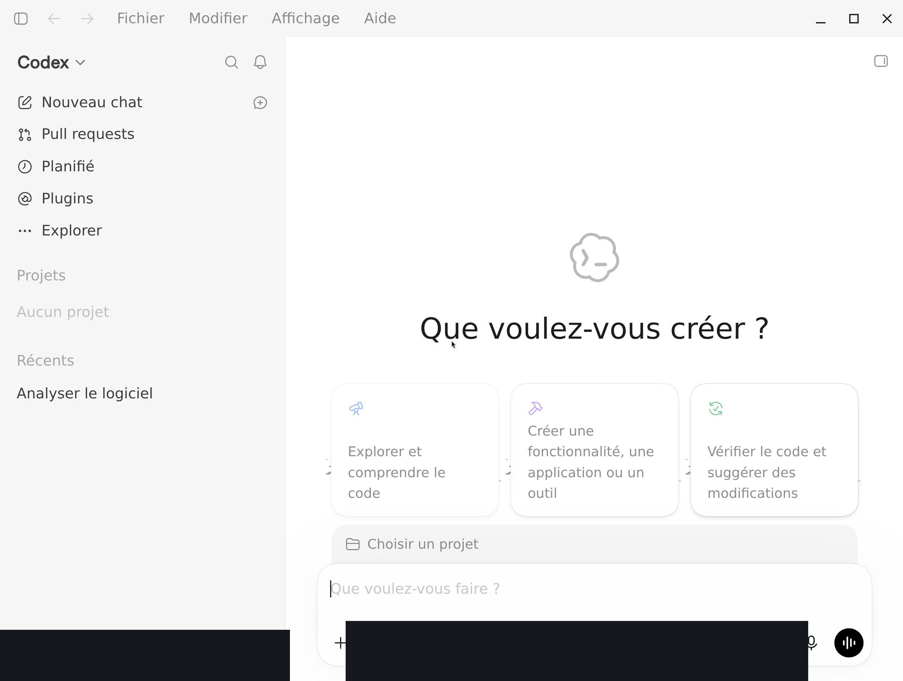
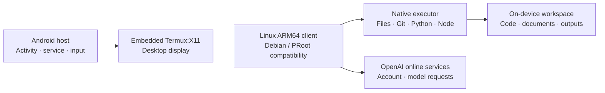

<div align="center">



### ChatGPT Desktop. Codex. A real workspace. On your Fold.

The Linux ARM64 desktop client, running locally on Android.<br>
Your projects and tools on the phone. No root or bootloader unlock required.

[](https://github.com/pironjulien/FoldGPT/releases/tag/v0.2.0-alpha.1)
[](https://github.com/pironjulien/FoldGPT/actions/workflows/public-checks.yml)
[](LICENSE)
[](CONTRIBUTING.md)

**[Explore the website](https://julienpiron.fr/foldgpt/)** · **[Documentation](docs/README.md)** · **[Release](https://github.com/pironjulien/FoldGPT/releases/tag/v0.2.0-alpha.1)** · **[Discussions](https://github.com/pironjulien/FoldGPT/discussions)**

</div>

## A desktop workspace that fits in your pocket

FoldGPT brings the ChatGPT desktop experience and Codex to the inner screen of a Galaxy Z Fold. Open a project, work with real files, run development tools, and create documents from the same desktop workspace — hosted on the phone.

The Android app combines an embedded display, a Linux compatibility environment, and a native command executor. The desktop runs locally; **model requests still use OpenAI’s online services**. No streamed desktop or separate remote computer is needed for the demonstrated runtime.

> **Source alpha for contributors.** This release opens the host and integration code for inspection and development. It does not include a consumer APK, a Linux image, or the proprietary ChatGPT client. Start with the [compatibility matrix](docs/compatibility.md) and [build guide](docs/build.md).

## What it brings to the Fold

| | Capability | What it enables |
| :--- | :--- | :--- |
| **01** | **Desktop ChatGPT & Codex** | A desktop surface rendered locally on the inner display, with touch and Android keyboard integration. |
| **02** | **Real project files** | Conversations that inspect, create, and edit files in a workspace stored on the device. |
| **03** | **Developer tools** | ARM64 command execution, with selected Python, Node, and Git workflows demonstrated on the development Fold. |
| **04** | **Document production** | Local tools for Word, PowerPoint, spreadsheets, and PDFs, including exercised creation and readback workflows. |
| **05** | **Android integration** | A host service, input bridge, and display lifecycle designed around Android and folding posture. |
| **06** | **An open foundation** | Source, compatibility adapters, checks, and engineering documentation that contributors can inspect and improve. |

Read the [product overview](docs/overview.md) for the experience and the [workspace tools guide](docs/workspace-dependencies.md) for supported document workflows.

## See the real interface

[](https://julienpiron.fr/foldgpt/#captures)

*A historical capture from the development Fold, with account details and session controls masked. The [showcase gallery](https://julienpiron.fr/foldgpt/#captures) also includes the real Android keyboard and ARM64 workspace settings. The interactive handset is a 3D visualization; the screen images are authentic captures, not a live session or recorded video. [Media provenance](site/assets/MEDIA-NOTICES.md).*

## How it works



FoldGPT runs under its own Android application UID. PRoot provides the Linux userspace compatibility; it does not provide full desktop Linux sandbox isolation. The integration includes a **version-specific client adapter**, so compatibility must be checked when the upstream client changes. See [architecture](docs/architecture.md) and [security](SECURITY.md).

## Start exploring

```sh
git clone https://github.com/pironjulien/FoldGPT.git
cd FoldGPT
```

The repository includes vendored Termux:X11 and PRoot sources. No recursive submodule initialization is required for this source release.

1. **Understand the scope:** read [overview](docs/overview.md) and [compatibility](docs/compatibility.md).
2. **Prepare a development build:** follow [build prerequisites, runtime inputs, and signing](docs/build.md). Runtime packages and the official client are separate inputs.
3. **Choose a contribution:** consult the [roadmap](docs/roadmap.md), open an [issue](https://github.com/pironjulien/FoldGPT/issues), or join a [discussion](https://github.com/pironjulien/FoldGPT/discussions).

| Explore | Start here |
| :--- | :--- |
| Android host, service, and input | [`android/app`](android/app) |
| Native execution and Android bridge | [`tools/executor`](tools/executor) |
| Runtime packaging and validation | [`tools/runtime`](tools/runtime) |
| Client compatibility patches | [`recovery/engine`](recovery/engine) |
| Product and engineering guides | [`docs`](docs/README.md) |
| Public showcase on julienpiron.fr | [`site`](site/README.md) |

## Where the alpha stands

The development Fold has demonstrated the desktop interface, local file and command operations, touch and keyboard input, and selected document workflows. The next milestones focus on **reproducible packaging, clean installation, and sustained runtime reliability**.

- **Android process pressure:** the observed phantom-process budget is shared across monitored child processes. Additional app packages do not multiply it. Process lifecycle and resource use remain active engineering work.
- **Session continuity:** extended background use, folding during active work, and several active conversations still need sustained qualification.
- **Distribution and updates:** a ready-to-install public APK, automatic client updates, and Remote are not qualified in this release.
- **Device scope:** development currently targets the Galaxy Z Fold 8; other devices need their own validation.

No root or bootloader unlock is required. The development phone was observed with a locked bootloader, verified boot green, and Knox warranty bit `0`. That observation is not a Samsung Pay certification. Display refresh rate is also distinct from measured application frame rate. The [compatibility guide](docs/compatibility.md) explains these boundaries.

## Build it with us

**Yes — anyone can propose improvements.** Fork the repository, open a focused pull request, or share an idea in Discussions. Maintainers review and merge contributions; you do not need write access to participate.

Useful areas include Android lifecycle, process efficiency, packaging, graphics, input, accessibility, documentation, and reproducible device testing. Independent simultaneous conversations remain a product requirement.

Read [contributing](CONTRIBUTING.md) before a change and use [private vulnerability reporting](SECURITY.md) for security issues.

## Credits & licensing

A project by **[julienpiron.fr](https://julienpiron.fr/)**. Built on work from the Termux:X11, PRoot, Debian, Mesa, and Android communities. Upstream code retains its own license and notices.

FoldGPT’s host and integration code are **GPL-3.0-or-later**. The ChatGPT client is a separate proprietary dependency, obtained from OpenAI. FoldGPT is an independent interoperability project and is not affiliated with, endorsed by, or distributed by OpenAI or Samsung. See [LICENSE](LICENSE), [LEGAL](LEGAL.md), and [third-party notices](THIRD_PARTY_NOTICES.md).

<div align="center">

**Unfold your workspace.**<br>
[Website](https://julienpiron.fr/foldgpt/) · [Roadmap](docs/roadmap.md) · [Changelog](CHANGELOG.md) · [FAQ](docs/faq.md)

</div>
