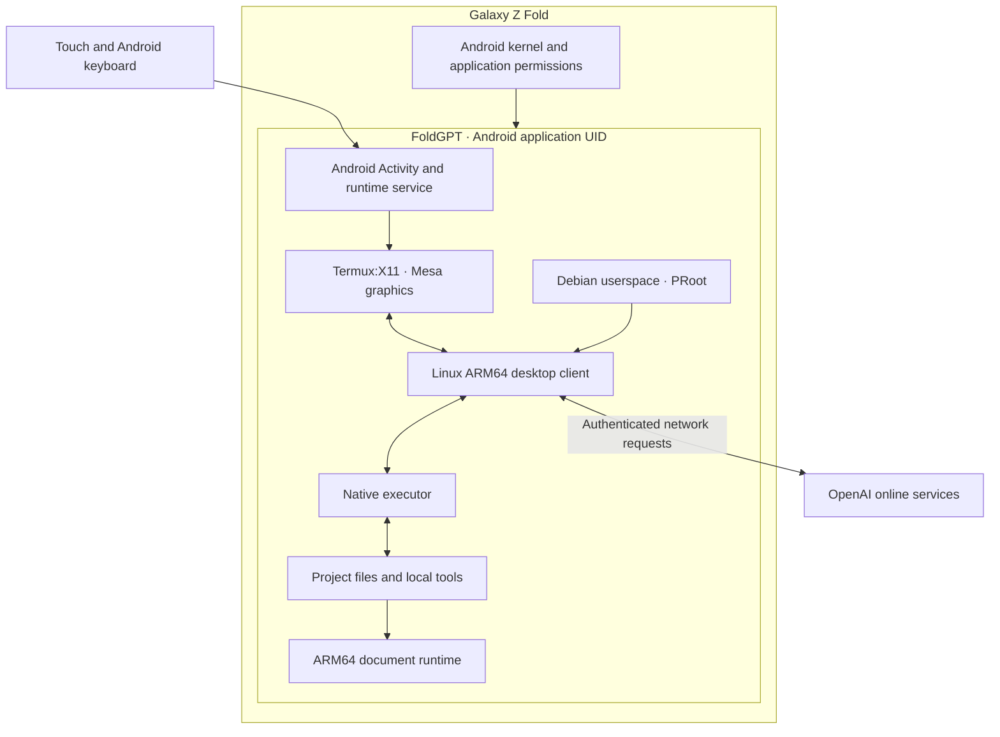

# How FoldGPT works

FoldGPT joins an Android application host with a Linux desktop environment and a local execution layer. The UI and tools run on the phone; model inference remains an online OpenAI service.

The diagram shows responsibilities and data flow, not a network security boundary.

## Android host

The display Activity handles the screen, input integration, and folding posture. A separate foreground runtime service owns startup and stop intent. Keeping these responsibilities separate allows the runtime to outlive the visible display Activity, subject to Android's lifecycle and resource policies.

The host includes runtime ownership, recovery, and cleanup logic. Controlled crash recovery and explicit stop behavior have been exercised. Android may still terminate child processes or require the user to reopen an app after a system force-stop.

## Linux compatibility and display

The desktop client's Linux ARM64 binaries require a GNU/Linux userspace. Debian and PRoot provide that compatibility environment on Android. Termux:X11 supplies the embedded desktop surface, while the Mesa path supports the tested Adreno GPU.

PRoot translates userspace behavior; it does not boot a Linux virtual machine or create an independent kernel. The Android kernel remains in charge of permissions, scheduling, memory, and process limits.

## Desktop integration

FoldGPT uses the official Linux desktop package as a separately obtained dependency. Two integration layers matter for maintenance:

- A compatibility shim changes behavior expected by the desktop client, including Linux sandbox checks.
- A workspace adapter modifies a limited ASAR integration point for a recognized client version. The original archive is retained by the adaptation flow, and an unknown version is rejected.

The current adapter targets client `26.901.41600`. A client update must be reviewed against the adapter before compatibility can be claimed. The project does not describe the adapted installation as an unmodified client.

## Execution and workspace tools

The native executor connects desktop requests to commands, file operations, and physical project storage under the Android application. Build admission requires a complete, explicitly selected executor package so a missing deployment does not silently select a different execution path.

The workspace runtime supplies ARM64-compatible Node, Python, document libraries, and rendering tools. GNU tools use the matching Linux environment; Android-native tools use their Android environment. Working directories, arguments, and exit codes must survive that boundary.

## Trust boundaries

The Android application UID is the primary operating-system boundary. PRoot and the compatibility shim do **not** recreate desktop Linux namespace isolation. Native project authority checks add controls but do not establish universal sandboxing for every plugin or tool.

Commands and installed integrations can access data within the permissions available to the runtime. Optional Android integrations have their own permission requirements. Their presence in the source does not mean those permissions are granted or every workflow is supported.

See the [security policy](../SECURITY.md) for reportable issues and the [compatibility matrix](compatibility.md) for the tested scope.

## Resource constraints

Desktop software starts helper processes that remain subject to Android's global child-process policy. The development phone reports a phantom-process budget of 32. That is not a private allowance for FoldGPT, and counting processes under its UID is not the same measurement.

The engineering direction is to reduce unnecessary process lifetimes, start tools when needed, and preserve independent conversation state. Splitting the same subprocess tree across ordinary APKs does not create a separate global budget for each one.
